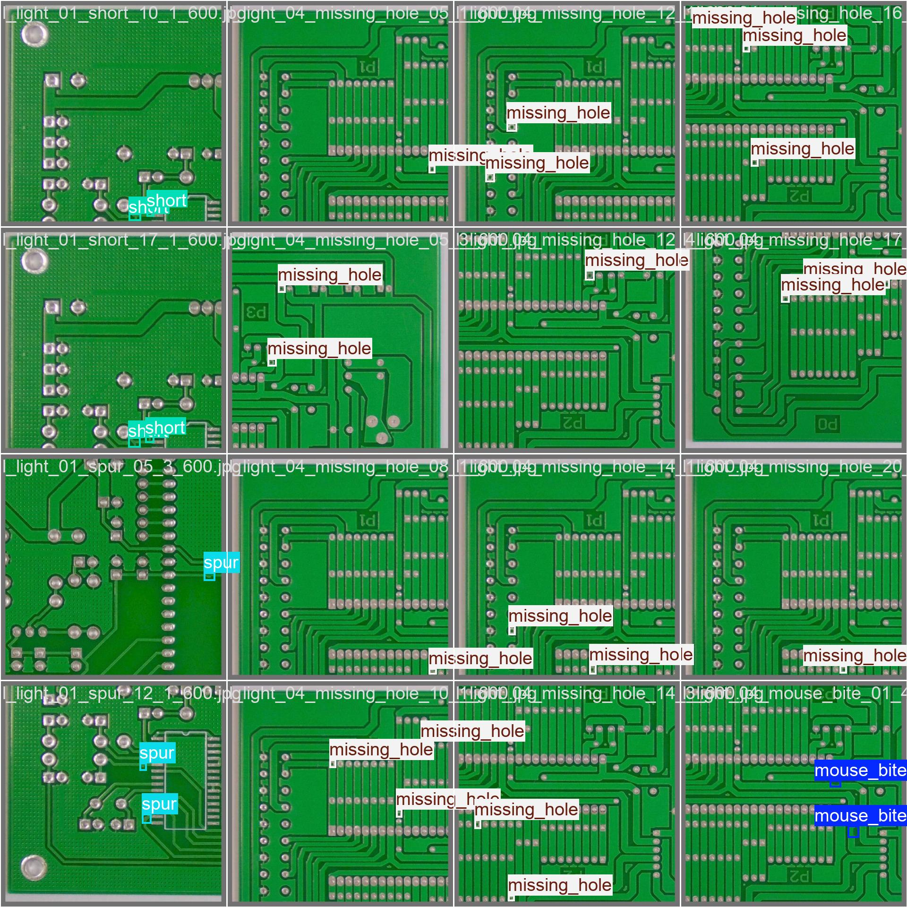

# AI-Based PCB Inspection System

An end-to-end Computer Vision application for automated Printed Circuit Board (PCB) defect detection using YOLO11.

The system detects common PCB manufacturing defects, evaluates board quality using a rule-based decision engine, and generates structured inspection reports suitable for industrial quality control workflows.

---

# Project Motivation

Printed Circuit Boards (PCBs) are critical components in electronic products, and manufacturing defects can significantly reduce product reliability.

Traditional manual inspection is:

- Time-consuming
- Expensive
- Inconsistent
- Difficult to scale

This project explores how Computer Vision and Deep Learning can automate PCB inspection while providing consistent and explainable inspection results.

---

# Problem Statement

Develop an AI-powered inspection system capable of:

- Detecting PCB defects
- Localizing each detected defect
- Estimating confidence
- Producing an overall quality assessment
- Generating structured inspection reports

Each PCB is classified as:

- PASS
- REWORK
- REJECT

---

# Why Object Detection?

Image classification only answers:

> Is this PCB defective?

Industrial inspection requires much more information.

Object Detection provides:

- Defect type
- Defect location
- Multiple defects in one image
- Confidence for every prediction

Making it much more suitable for manufacturing inspection.

---

# Why YOLO11?

YOLO11 was selected because it offers:

- High detection accuracy
- Fast inference
- Lightweight deployment
- Excellent real-time performance
- Strong support within the Ultralytics ecosystem

---

# Methodology

The project follows the **CRISP-DM** methodology.

| Phase | Document |
|-------|----------|
| 1. Business Understanding | [docs/01_business_understanding.md](docs/01_business_understanding.md) |
| 2. Data Understanding | [docs/02_data_understanding.md](docs/02_data_understanding.md) |
| 3. Data Preparation | [docs/03_data_preparation.md](docs/03_data_preparation.md) |
| 4. Modeling | [docs/04_modeling.md](docs/04_modeling.md) |
| 5. Evaluation | [docs/05_evaluation.md](docs/05_evaluation.md) |
| 6. Deployment | [docs/06_deployment.md](docs/06_deployment.md) |

---

# Features

- PCB defect detection
- Modular inspection pipeline
- Automated quality scoring
- PASS / REWORK / REJECT decision
- JSON inspection reports
- Detection visualization
- Object-oriented architecture

---

# System Architecture

The PCB inspection system follows a modular pipeline that converts raw images into structured defect reports.

```
Image
      │
      ▼
YOLO Detector
      │
      ▼
Result Converter
      │
      ▼
PCBDefect Objects
      │
      ▼
Inspection Manager
      │
      ▼
Decision Engine
      │
      ▼
Inspection Report
      │
      ▼
Visualizer
```

The detector output is converted into defect objects, inspected by a rule-based decision engine, and finally written to a JSON report with visualization overlays.

---

# Project Structure

```text
src/
├── config.py
├── detector/
├── evaluate.py
├── inspection/
├── main.py
├── predict.py
├── train.py
├── visualizer.py
├── vedio_demo.py

datasets/
├── data.yaml
├── train/
├── val/
└── test/

models/
├── best.pt

runs/
├── yolo11/
├── yolo26n/
└── yolo26m/

docs/
├── 01_business_understanding.md
├── 02_data_understanding.md
├── 03_data_preparation.md
├── 04_modeling.md
├── 05_evaluation.md
├── 06_deployment.md
└── assets/

requirements.txt
README.md
```

---

# Dataset

The dataset contains six PCB defect categories:

- Mouse Bite
- Spur
- Missing Hole
- Short
- Open Circuit
- Spurious Copper

The dataset split used for training and evaluation is approximately:

| Split | Images |
|--------|--------:|
| Train | 8534 |
| Validation | 1066 |
| Test | 1068 |

---

# Training

The project uses an Ultralytics YOLO implementation for model training.

```python
from ultralytics import YOLO

model = YOLO("yolo11s.pt")

model.train(
    data="datasets/data.yaml",
    epochs=20,
    imgsz=640,
    batch=16
)
```

Training can also be run for YOLO26 variants using the corresponding `runs/yolo26n` or `runs/yolo26m` configuration directories.

---

# Results

The current evaluation compares YOLO11s, YOLO26n, and YOLO26m across the same defect dataset.

## Sample Prediction

### Ground Truth



### Prediction


---

## Confusion Matrix


---

## Precision-Recall Curve


---

## Training Curves


---

## Model Comparison

In addition to the baseline YOLO11 implementation, the project evaluates the YOLO26 architecture and compares multiple model variants under identical experimental conditions while considering hardware constraints. This includes YOLO26n for lightweight deployment and YOLO26m for higher accuracy.

# Future Improvements

- Instance Segmentation
- FastAPI deployment
- Docker support
- Explainable AI
- TensorRT optimization
- Multi-camera inspection

---

# Technologies

- Python
- PyTorch
- YOLO11
- OpenCV
- NumPy
- Ultralytics
- Git

---

# Documentation

Detailed CRISP-DM documentation is available in `docs/`:

- [01 — Business Understanding](docs/01_business_understanding.md)
- [02 — Data Understanding](docs/02_data_understanding.md)
- [03 — Data Preparation](docs/03_data_preparation.md)
- [04 — Modeling](docs/04_modeling.md)
- [05 — Evaluation](docs/05_evaluation.md)
- [06 — Deployment](docs/06_deployment.md)

Evaluation figures are stored in `docs/assets/` so they render on GitHub. Full training outputs remain in `runs/` (local only, gitignored).

---

# License

MIT License