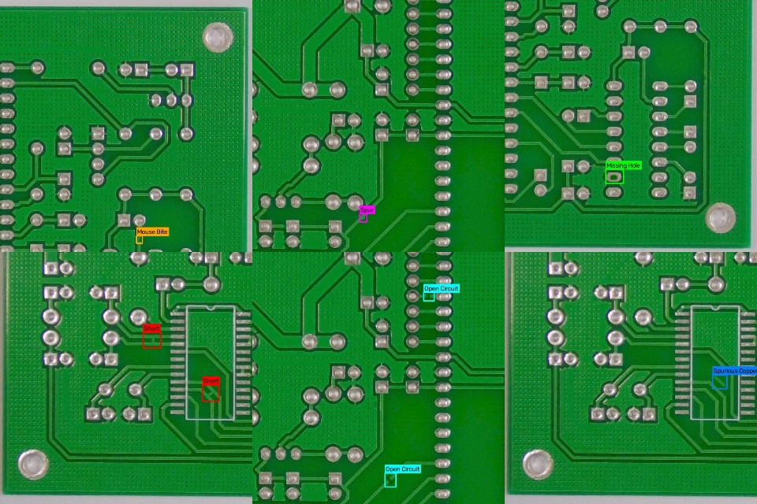
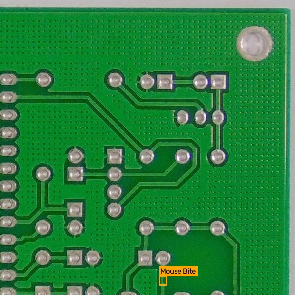
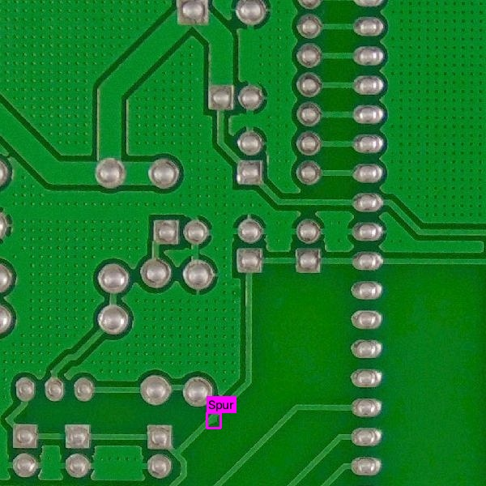
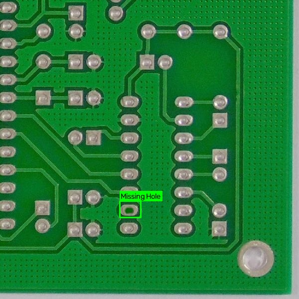
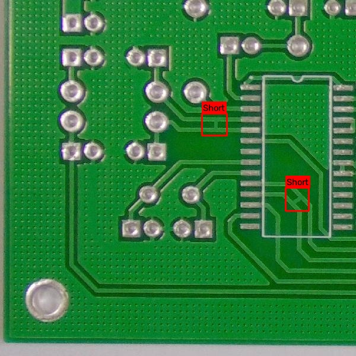
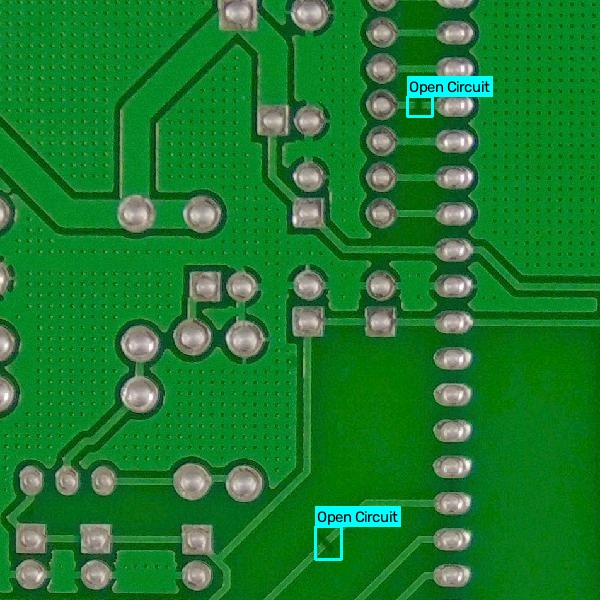
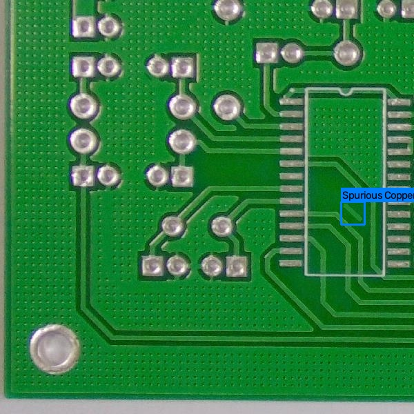
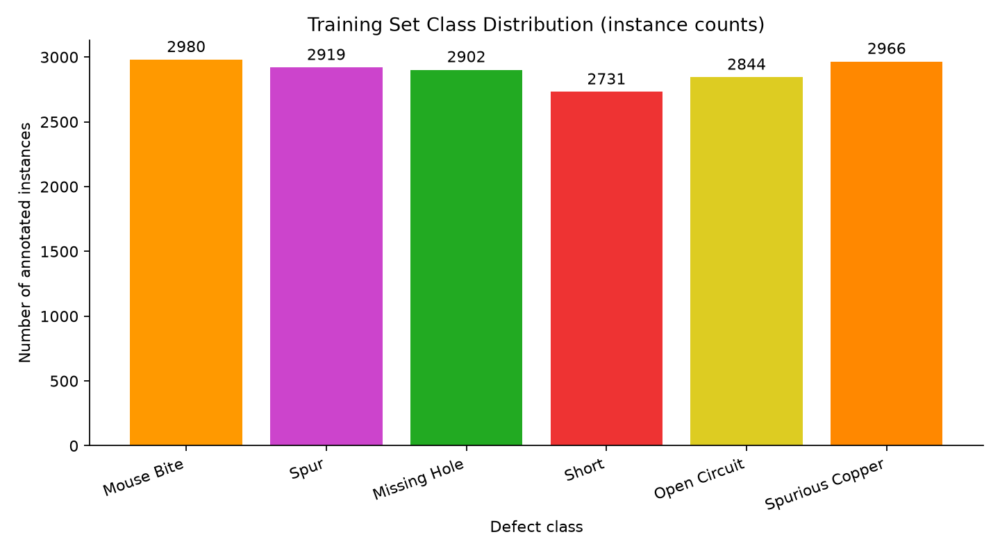

# Data Understanding

## Dataset Source

PCB Defect Dataset — publicly available PCB defect detection dataset with six annotated defect classes.
https://www.kaggle.com/datasets/akhatova/pcb-defects

---

## Classes

- Mouse Bite
- Spur
- Missing Hole
- Short
- Open Circuit
- Spurious Copper

---

## Dataset Statistics

| Split | Images |
|--------|--------|
| Train | 8534 |
| Validation | 1066 |
| Test | 1068 |

---

## Sample Training Images with Annotations

The figures below show real training samples with ground-truth bounding boxes drawn from the YOLO label files. Each example highlights one primary defect class.

### Overview Grid

### Mouse Bite

### Spur

### Missing Hole

### Short

### Open Circuit

### Spurious Copper

---

## Class Distribution

Instance counts were computed from the YOLO label files in the training split (17,342 annotated instances across 8,534 images).

| Class | Instances |
|--------|----------:|
| Mouse Bite | 2980 |
| Spur | 2919 |
| Missing Hole | 2902 |
| Short | 2731 |
| Open Circuit | 2844 |
| Spurious Copper | 2966 |

The classes are well balanced — no single defect type dominates the training set.
