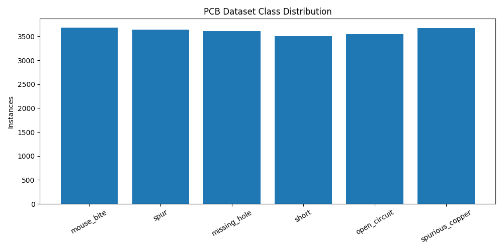

# Data Understanding

## Dataset Source

PCB Defect Dataset — publicly available PCB defect detection dataset with six annotated defect classes.
https://www.kaggle.com/datasets/akhatova/pcb-defects

---

## Classes

- Mouse Bite
- Spur
- Missing Hole
- Short
- Open Circuit
- Spurious Copper

---

## Dataset Statistics

| Split | Images |
|--------|--------|
| Train | 8534 |
| Validation | 1066 |
| Test | 1068 |

---

## Class Distribution

The chart above shows the per-class instance distribution. 